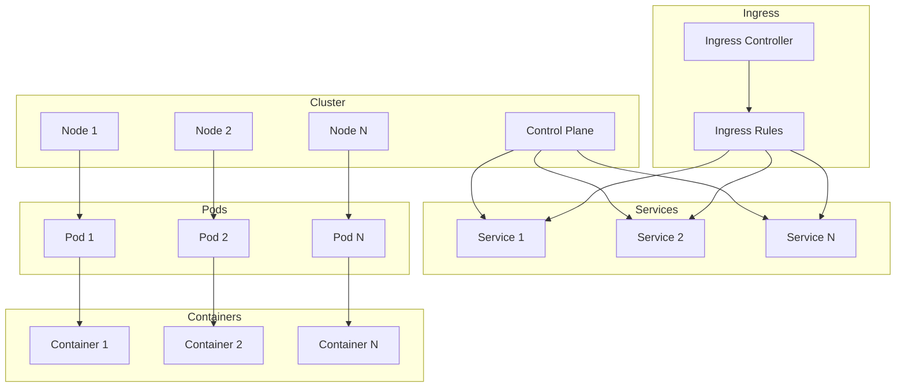
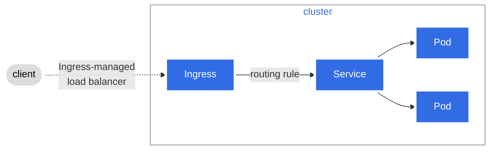

# Dependancies:
- Docker (local desktop)
- Visual studio code
- GIT

## After devcontainer is completely started:
- Launch `./helper.sh` in a seperate console and let it run
- Run `./configure_grafana.sh`

## Useful `kubectl` commands
Get Pods: Lists all pods in the current namespace. Use `-w` to follow changes
`kubectl get pods`

Describe Deployment: Provides detailed information about a specific deployment.
`kubectl describe deployment.apps <deploymentName>`

Apply: configure a new desired state: 
`kubectl apply -f <path-to-yaml-configuration>`

Port Forward: Forwards local ports to a pod’s ports.
`kubectl port-forward <podName> localPort:podPort`

## General architectal structure of k8s

## Detailed architectal structure of k8s and the client-pod communication

